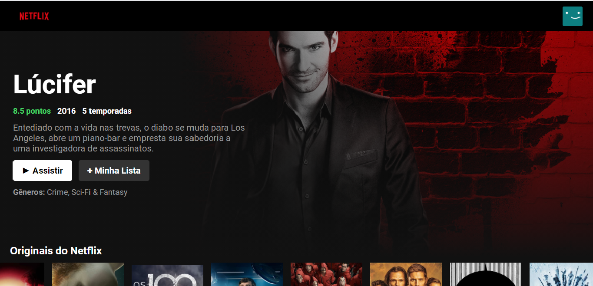

<h1 align="center">
Clone da Netflix
</h1>

## 💻 Sobre o projeto

O projeto copia a interface da Netflix, usando a API da TMDB.

## 🖼 Screenshot da tela da aplicação




## 🛠 Tecnologias

As seguintes ferramentas foram usadas na construção do projeto:

### **Front-end**


- [X] React<br>
- [X] Javascript<br>
- [X] CSS<br>
- [X] MaterialUI<br>


## 👷 Como rodar

```bash
# Clonar o repositório
git clone https://github.com/MarcelFeo/netflix-clone-react.git

# Entrar numa IDE de sua preferência 

# Executar o servidor ou usar um puglin que criar um servidor

# Não se esqueça de pegar sua API key gratuita no site da TMDB

```

Feito isso, abra o seu navegador e acesse `http://localhost:3000/`
ou em uma porta de sua preferência.
